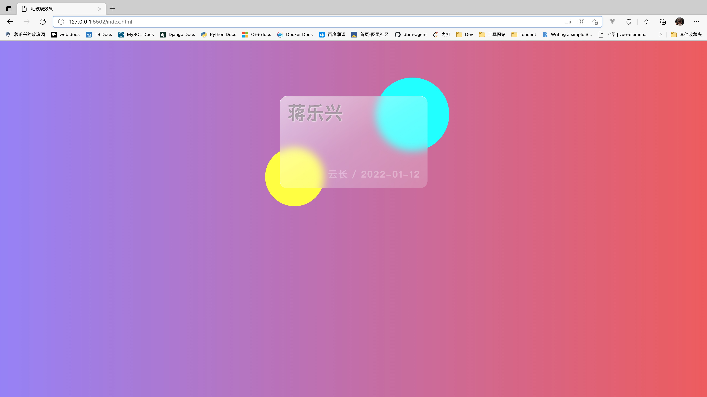

## CSS-效果练习

[toc]

---

#### 001 毛玻璃效果

---

#### 002 弹性旋转菜单

--

#### 003 轮播放图

---

##### 感谢

1、陳山羊 : https://e.coding.net/goatchen/html-css/HTML-CSS.git
2、mumaniu : https://github.com/luoyunqa

---